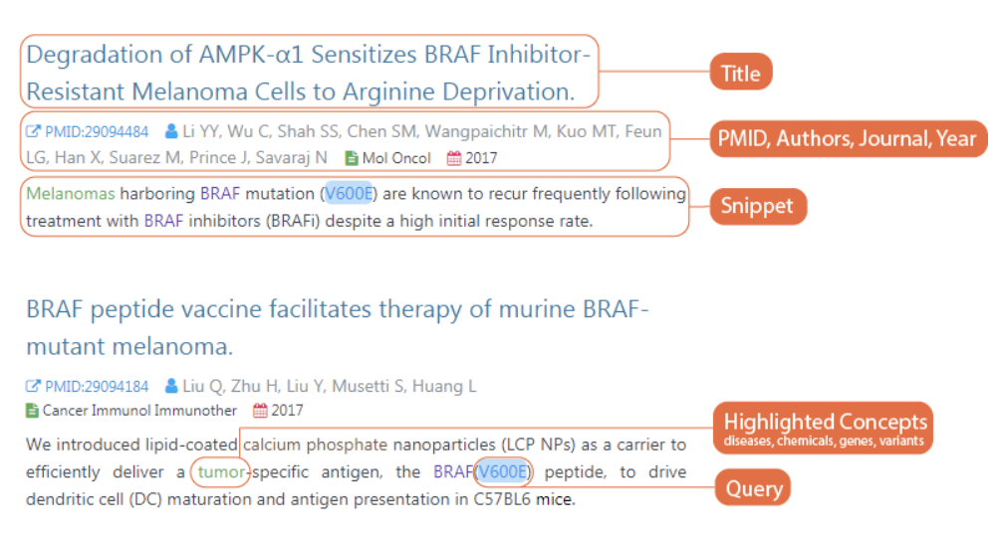

# LitVar Full

## Differences with basic LitVar annotator

LitVar Full expands the data available in the base LitVar annotator to include the number of PubMed IDs found for a variant, as well as listing out the PubMed IDs found in the most recent search.

Because this annotator queries the LitVar API for each variant known to have results, it will be slower than the base LitVar annotator. For large input files with many well-studies variants, please expect LitVar Full to be among the last annotators to finish.

## About LitVar

LitVar provides access to genomic variant information from the biomedical literature by mining the 27 million PubMed abstracts and 1+ million PMC full-text articles. LitVar shows the results of research conducted in the Computational Biology Branch, NCBI.

LitVar does the following:

* Uses tmVar, a high-performance variant name disambiguation engine, to normalize different forms of the same variant into a unique and standardized name so that all matching articles can be returned regardless the use of a specific name in the query.

* Processes the entire set of full-text articles from the open access PMC subset in addition to PubMed in order to provide relevant variant information beyond title and abstracts.

* Leverages the state-of-the-art literature annotation tool, PubTator, to provide key biological relations among variations, drugs, genes, and diseases.

## Understanding Results

LitVar displays 15 publications per page with the most recent publications shown first.

When examining returned publications, you can find pre-annotated biological concepts (displayed in color) as well as concepts matching the query (displayed with a colored background). Each color corresponds to a different biological concept: variant, gene, disease, or chemical.

## Using Concept Filters

#### Ranked biological concepts
Concept filters show genes, diseases, chemicals, and variants that are the most commonly co-occur with the query variant in the same sentence.

#### Add biological concepts to search
You can click on these concepts to narrow down search results. In that case, only publications containing all the selected concepts (including user submitted variant and selected concepts) will be returned.

## Using Publication Filters

Publication-level filters show the top journals in which matching publications were published, as well as the types of these publications, and the number of publications in the last year, last 2 years and last 5 years. You can filter your results by selecting a journal, publication date or publication types.

## Acknowledgements

LitVar is developed by the NCBI Text Mining Research Group at the Computational Biology Branch, with help from the dbSNP group at the Information Engineering Branch. 

This research is supported by the Intramural Research Programs of the National Institutes of Health, National Library of Medicine.

Information from https://www.ncbi.nlm.nih.gov/CBBresearch/Lu/Demo/LitVar/index.html#!?query=