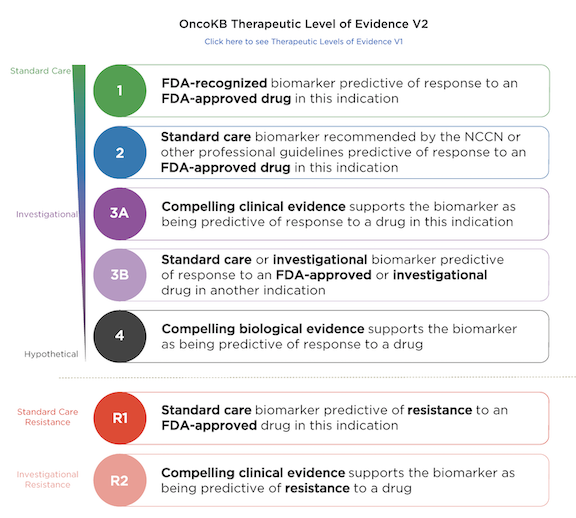

## _OncoKB is only available for local use. See the Prerequisite section for installation details._

# OncoKB: MSK's Precision Oncology Knowledge Base

OncoKB is a precision oncology knowledge base developed at Memorial Sloan Kettering Cancer Center that contains biological and clinical information about genomic alterations in cancer.

Alteration- and tumor type-specific therapeutic implications are classified using the [OncoKB Levels of Evidence system](https://www.oncokb.org/levels), which assigns clinical actionability to individual mutational events.

For additional details about the OncoKB curation process, please refer to the version-controlled [OncoKB Curation Standard Operating Procedure](https://www.oncokb.org/sop). When using OncoKB, please cite: [Chakravarty et al., JCO PO 2017](https://ascopubs.org/doi/full/10.1200/PO.17.00011).

Information from https://www.oncokb.org/

**Prerequisite**

*OncoKB is only available for local use*. OncoKB API token is required to run this module. See [the OncoKB API documentation](https://api.oncokb.org/oncokb-website/api) on getting an OncoKB API token.

First, you will need to create an account and request API access. Once you have received an API token, you can go to your [account settings](https://www.oncokb.org/account) to copy the API token.

To add your token to your local installation, you will need to create a `token.txt` file with the token string as the only content under the `data` sub-folder (create it if needed) of this module's folder. To do this you can open a terminal and use the following commands:

```bash
# see where your local modules installation directory is
oc config md
# go to your local modules installation directory
cd `oc config md`
# go to the oncoKB folder
cd annotators/oncoKB
# make a data directory
mkdir data
# make the token.txt file
cat {YOUR_API_TOKEN_STRING} > data/token.txt
```


