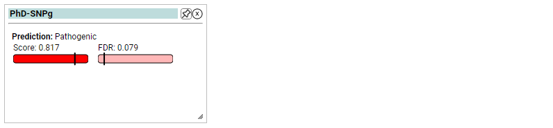

# PhD-SNPg

A binary classifier for predicting pathogenic variants in coding and non-coding regions.

PhD-SNPg is a binary classifier that implements Gradient Boosting-based algorithm from scikit-learn package (http://scikit-learn.org/). PhD-SNPg has been trained and tested using a set of ~37,000 Pathogenic and Benign SNVs extracted from Clinvar dataset.

 

## Clinical Application

 The ClinGen Sequence Variant Interpretation Working Group reccommends that calibrated scores from select variant effect predictors are reliable as Very Strong, Strong, or Moderate evidence for Pathogenicity (PP3) or Benignity (BP4) within ACMG/AMP Guidelines (Pejaver, Vikas et al. “Calibration of computational tools for missense variant pathogenicity classification and ClinGen recommendations for PP3/BP4 criteria.” American journal of human genetics vol. 109,12 (2022): 2163-2177. doi:10.1016/j.ajhg.2022.10.013). PhD-SNPg scores have been calbrated by the Karchin Lab according to these methods using the code and variant sites.

| ACMG Category    | Strength    | PhD-SNPg Thresholds |
|------------------|-------------|--------------------:|
| Benign (BP4)     | Very Strong |                   - |
|                  | Strong      |                   - |
|                  | Moderate    |            <= 0.298 |
|                  | Supporting  |      (0.298, 0.665] |
| Pathogenic (PP3) | Supporting  |      (0.972, 0.988] |
|                  | Moderate    |              >0.988 |
|                  | Strong      |                   - |
|                  | Very Strong |                   - |

 \* A "-" means that PhD-SNPg did not meet the posterior probability threshold. Note that "(" and ")" indicate exclusion of the end value and “[” and “]” indicate inclusion of the end value.

 ### Indeterminate Scores

 If the PhD-SNPg score does not fit within the thresholds above, Benign (BP4) and Pathogenic (PP3) columns are left blank and described as "Indeterminate" in the corresponding PhD-SNPg widget.

