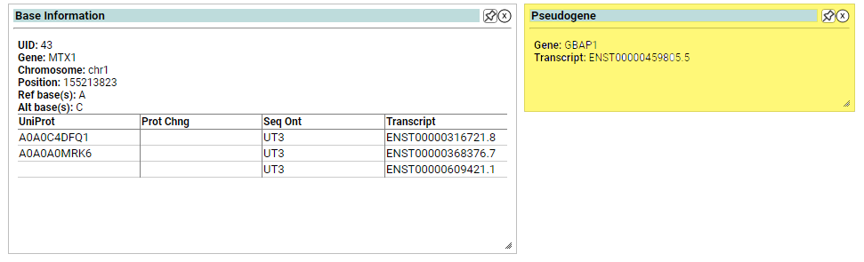

# Pseudogene
The GENCODE Genes track (version 28, Apr 2018) shows high-quality manual annotations merged with evidence-based automated annotations across the entire human genome generated by the GENCODE project. The GENCODE gene set presents a full merge between HAVANA manual annotation process and Ensembl automatic annotation pipeline. Priority is given to the manually curated HAVANA annotation using predicted Ensembl annotations when there are no corresponding manual annotations. The 28 annotation was carried out on genome assembly GRCh38 (hg38).

GENCODE Pseudogenes include all annotations except polymorphic pseudogenes.

The data for the pseudogene annotator can be found at the URL: https://www.gencodegenes.org/human/  

This website page contains the latest Gencode Human Genome files.  The file that is used by this annotator interface is the GFF3 file for comprehensive gene annotation for the chromosome region. Example: gencode.v42.annotation.gff3 (noting that this example is the latest file for version 42) When this file is parsed, only records containing the term "pseudogene" in either the Gene Type or Transcript Type field will be selected. The output product from the build process is a pickle file: pseudogene.pickle
 

 