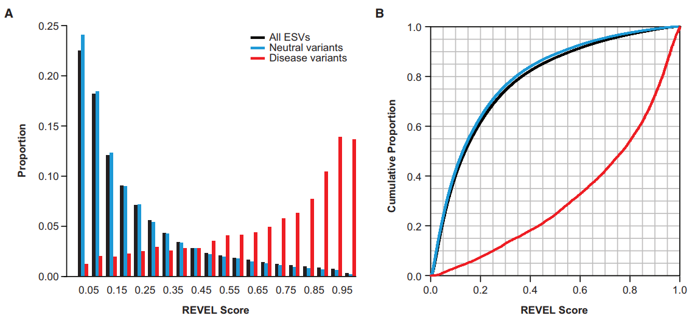

 
REVEL is an ensemble method for predicting the pathogenicity of missense variants based on a combination of scores from 13 individual tools: MutPred, FATHMM v2.3, VEST 3.0, PolyPhen-2, SIFT, PROVEAN, MutationAssessor, MutationTaster, LRT, GERP++, SiPhy, phyloP, and phastCons.  REVEL was trained using recently discovered pathogenic and rare neutral missense variants, excluding those previously used to train its constituent tools.  The REVEL score for an individual missense variant can range from 0 to 1, with higher scores reflecting greater likelihood that the variant is disease-causing.  When applied to two independent test sets, REVEL had the best overall performance (p<10-12) compared with any individual tool and seven ensemble methods: MetaSVM, MetaLR, KGGSeq, Condel, CADD, DANN, and Eigen.  Importantly, REVEL also had the best performance for distinguishing pathogenic from rare neutral variants with allele frequencies <0.5%.  Compared with other ensemble methods, the area under the receiver operating characteristic curve (AUC) for REVEL was 0.046-0.182 higher in an independent test set of 935 recent SwissVar disease variants and 123,935 putatively neutral exome sequencing variants, and 0.027-0.143 higher in an independent test set of 1953 pathogenic and 2406 benign variants recently reported in ClinVar.  We provide precomputed REVEL scores for all possible human missense variants to facilitate the identification of pathogenic variants in the sea of rare variants discovered as sequencing studies expand in scale.

## Clinical Application

The ClinGen Sequence Variant Interpretation Working Group reccommends that calibrated scores from select variant effect predictors are reliable as Very Strong, Strong, or Moderate evidence for Pathogenicity (PP3) or Benignity (BP4) within ACMG/AMP Guidelines (Pejaver, Vikas et al. “Calibration of computational tools for missense variant pathogenicity classification and ClinGen recommendations for PP3/BP4 criteria.” American journal of human genetics vol. 109,12 (2022): 2163-2177. doi:10.1016/j.ajhg.2022.10.013).

REVEL scores have been calbrated and validated as reliable to support Benign Supporting, Benign Moderate, Benign Strong, Benign Very Strong, Pathogenic Supporting, Pathogenic Moderate, and Pathogenic Strong ACMG/AMP evidence for purposes of variant classification in the clinic.

| REVEL Thresholds |                 |                |                |                |                |                |                |                |
|--------------|-----------------|----------------|----------------|----------------|----------------|----------------|----------------|----------------|
| Benign (BP4) |||| Pathogenic (PP3)|
|Very Strong   |Strong      |Moderate     |Supporting   |Supporting   |Moderate     |Strong      |Very Strong   |
|≤0.003|(0.003, 0.016]|(0.016, 0.183]|(0.183, 0.290]|[0.644, 0.773)|[0.773, 0.932)|	≥0.932|   -   |

\* A "-" means that BayesDel did not meet the posterior probability threshold. Note that "(" and ")" indicate exclusion of the end value and “[” and “]” indicate inclusion of the end value.

### Indeterminate Scores

If the REVEL score does not fit within the thresholds above, Benign (BP4) and Pathogenic (PP3) columns are left blank and described as "Indeterminate" in the corresponding REVEL widget.