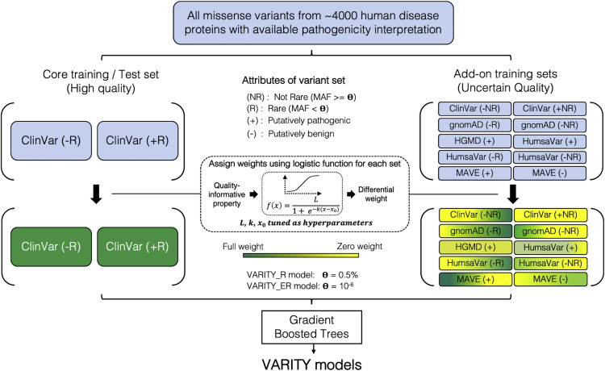

# VARITY

The success of personalized genomic medicine depends on our ability to assess the pathogenicity of rare human variants, including the important class of missense variation. There are many challenges in training accurate computational systems, e.g., in finding the balance between quantity, quality, and bias in the variant sets used as training examples and avoiding predictive features that can accentuate the effects of bias. Here, we describe VARITY, which judiciously exploits a larger reservoir of training examples with uncertain accuracy and representativity. To limit circularity and bias, VARITY excludes features informed by variant annotation and protein identity. To provide a rationale for each prediction, we quantified the contribution of features and feature combinations to the pathogenicity inference of each variant. VARITY outperformed all previous computational methods evaluated, identifying at least 10% more pathogenic variants at thresholds achieving high (90% precision) stringency.

The VARITY approach for pathogenicity prediction, which has been specifically optimized for rare missense variation. While VARITY uses a meta-prediction strategy, it limits the circularity that can arise in such approaches by excluding any feature that was informed by variant pathogenicity annotation. We also exclude features that may serve as proxies for protein identity because these may lead to predictions that are biased by the fraction of each protein’s variants in the training set that are annotated pathogenic (which may be inaccurate in future application settings). VARITY judiciously harnesses a larger set of training examples with uncertain accuracy and representativity and uses differential weighting strategies to ensure that training set expansion improves performance on a high-quality test set. Amongst other features, VARITY uses scores from PROVEAN, SIFT, LRT, GERP++, phyloP, phastCons, and SiPhy.

## Clinical Application

 The ClinGen Sequence Variant Interpretation Working Group reccommends that calibrated scores from select variant effect predictors are reliable as Very Strong, Strong, or Moderate evidence for Pathogenicity (PP3) or Benignity (BP4) within ACMG/AMP Guidelines (Pejaver, Vikas et al. “Calibration of computational tools for missense variant pathogenicity classification and ClinGen recommendations for PP3/BP4 criteria.” American journal of human genetics vol. 109,12 (2022): 2163-2177. doi:10.1016/j.ajhg.2022.10.013).

VARITY scores have been calbrated and validated as reliable to support Benign Supporting, Benign Moderate, Benign Strong, Benign Very Strong, Pathogenic Supporting, Pathogenic Moderate, and Pathogenic Strong ACMG/AMP evidence for purposes of variant classification in the clinic. Calibration cutoffs were obtained from Bergquist et al., “Calibration of Additional Computational Tools Expands ClinGen Recommendation Options for Variant Classification with PP3/BP4 Criteria.” bioRxiv 2024.09.17.611902; doi:10.1101/2024.09.17.611902

 | ESM1b Thresholds |        |                |                 |                  |                |         |             |
 |------------------|--------|----------------|-----------------|------------------|----------------|---------|-------------|
 | Benign (BP4)     |        |                |                 | Pathogenic (PP3) |                |         |             |
 | Very Strong      | Strong | Moderate       | Supporting      | Supporting       | Moderate       | Strong  | Very Strong |
 | -                | ≤0.036 | (0.036, 0.116] | (0.0116, 0.251] | (0.675, 0.841]   | (0.841, 0.964] | >0.964 | -           |

 \* A "-" means that Varity did not meet the posterior probability threshold. Note that "(" and ")" indicate exclusion of the end value and “[” and “]” indicate inclusion of the end value.

### Indeterminate Scores

 If the Varity score does not fit within the thresholds above, Benign (BP4) and Pathogenic (PP3) columns are left blank and described as "Indeterminate" in the corresponding Varity widget.
