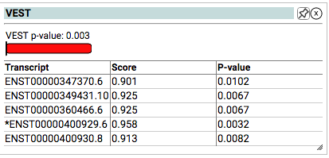

# VEST

A machine learning method that predicts the functional significance of missense mutations based on the probability that they are pathogenic. Precomputed across the entire exome for rapid annotation.

 

http://karchinlab.org/apps/appVest.html

## Clinical Application

The ClinGen Sequence Variant Interpretation Working Group reccommends that calibrated scores from select variant effect predictors are reliable as Very Strong, Strong, or Moderate evidence for Pathogenicity (PP3) or Benignity (BP4) within ACMG/AMP Guidelines (Pejaver, Vikas et al. “Calibration of computational tools for missense variant pathogenicity classification and ClinGen recommendations for PP3/BP4 criteria.” American journal of human genetics vol. 109,12 (2022): 2163-2177. doi:10.1016/j.ajhg.2022.10.013).

VEST4 scores have been calbrated and validated as reliable to support Benign Supporting, Benign Moderate, Pathogenic Supporting, Pathogenic Moderate, and Pathogenic Strong ACMG/AMP evidence for purposes of variant classification in the clinic.

| ACMG Category    | Strength    | VEST4 Thresholds |
|------------------|-------------|-----------------:|
| Benign (BP4)     | Very Strong |                - |
|                  | Strong      |                - |
|                  | Moderate    |           ≤0.302 |
|                  | Supporting  |   (0.302, 0.449] |
| Pathogenic (PP3) | Supporting  |   [0.764, 0.861) |
|                  | Moderate    |   [0.861, 0.965) |
|                  | Strong      |           ≥0.965 |
|                  | Very Strong |                - |

\* A "-" means that VEST4 did not meet the posterior probability threshold. Note that "(" and ")" indicate exclusion of the end value and “[” and “]” indicate inclusion of the end value.

### Indeterminate Scores

If the VEST score does not fit within the thresholds above, Benign (BP4) and Pathogenic (PP3) columns are left blank and described as "Indeterminate" in the corresponding VEST widget.
