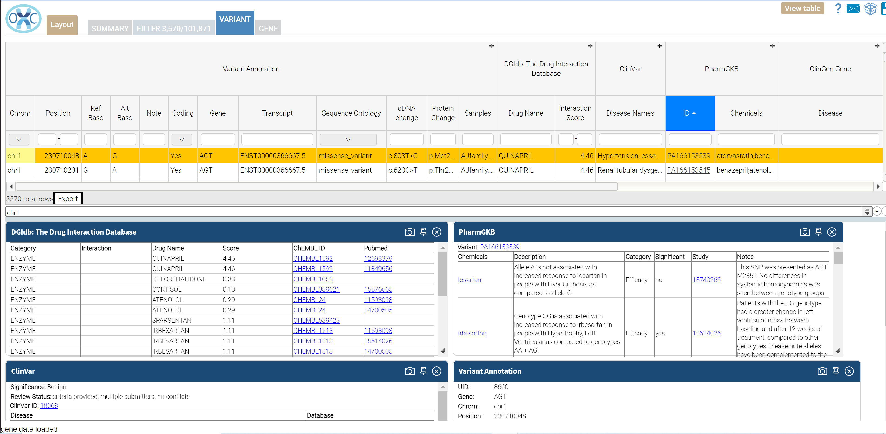

# Drug Interaction: Package that identifies variants with potential impact on drug responce.

This package integrates several sources of information on genetic variation and drug responce. Variants with a clinical significance in ClinVar of drug responce
or an annotation in PharmGKB are included in the output.  Variants that change the coding sequence of a gene with known drug interactions from DGIdb are also included.

The result viewer layout in the packages has been optimized for review of drug response information and the filter used may be adjused on the Filter tab.

Source Annotators:
- ClinVar - Clinical Variant Annotation
- PharmGKB - database of genetic variants associated with altered responce to medications
- DGIdb - Drug Interaction database
 
Filter:  
- ClinVar annotation of drug response 
OR
- Listed in PharmGKB
OR
- Non-synonymous protein coding variant on a gene in the Drug Interaction db

Reports:
- Excel
- Tab delimited

 