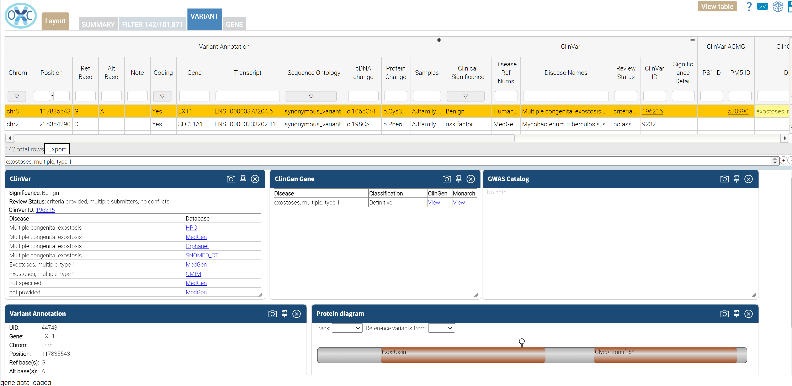

# Pathogenic: Package that identifies variants disease related variants.

This package identifies variants that have been annotated as being associated with disease.  The primary source for this package is ClinVar.  Variants
designated as pathogentic or a risk factor in ClinVar are selected by this package.  ClinVar ACMG follows established guidelines to select additional 
variants that have not been identified as pathogenic but alter the same amino acid that has been shown to cause disease.  DenovoDB and the GWAS Catalog
are also surveyed to identify additional potental disease releted variants.  ClinGen is include to provide additional context for selected variants but 
is not used in filtering.

The display in OpenCRAVAT results viewer has been optimized for display of pathogenitic analysis.  The filter criterion may be modified on the filter tab.

Source Annotators:
- ClinVar
- ClinVar ACMG
- DenovoDB
- GWAS Catalog
- ClinGen
 
Filter:  
- ClinVar annotation of pathogenic, likely pathogenic, risk factor, or uncertain with some indication of pathogenicity 
OR
- Potentially pathogenic by ACMG PS1 or PM5 guidelines
OR
- Non-synonymous protein coding variant on a gene in the Drug Interaction db
OR
- GWAS Catalog association
or 
- Denovo DB association

Reports:
- Excel
- Tab delimited

 