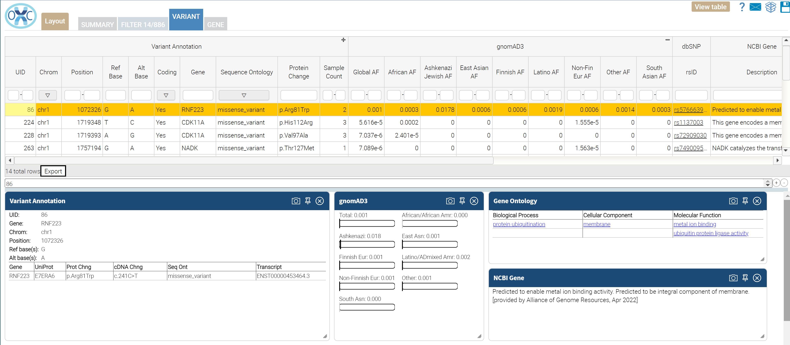

# Rare_Coding: Package that identifies rare variants that alter protein coding sequence.

The impact of variants is determined by the OpenCRAVAT mapper.  Variants are considered protein coding variants if a single base substitution, insertion, 
or deletion results in an alteration of protein amino acid sequence produced by the affected gene.  Protein coding changes include single amino acid 
substitutions, indel related sequence loss or gain, stop/start loss, stop/start gain, frame shifts, and splicing related sequence changes.  Synonymous 
variants that do not alter protein sequence are excluded.

The gnomAD3 annotator is used to determine variant allele frequency.  Only variants occurring in the general population less than 1% of the time are included.
Note: A review of population specific allele frequency may be appropriate as a variant could occur at higher rates in specific sub-populations.

NCBI Gene, dbSNP, and GO annotators are included in the package to provide additional context for the variants but are not used for filtering.

Default filters can be adjusted on the Filter tab of the OpenCRAVAT results viewer.

Source Annotators:
- gnomAD3 - Very large study of variant population statistics.
- NCBI Gene - General gene descriptions
- GO - Gene Ontology annotation provides categorical background on the gene related to the variant
- dbSNP - Standard variant identification system

 
Filter:  
- Non-synonymous protein coding variants
AND
- gnomAD global population allele frequency < 1% 

Reports:
- Excel
- Tab delimited

 