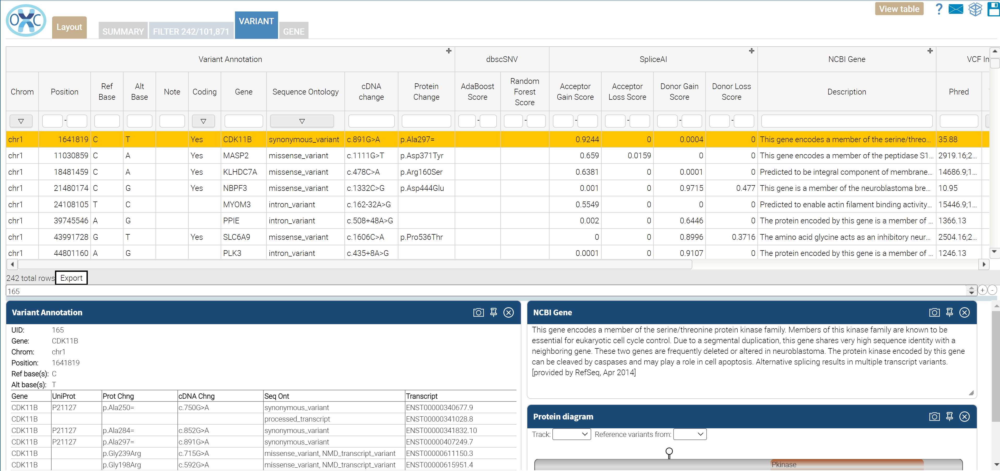

# Splicing: Package that identifies variants that are likely to alter mRNA splicing patterns.

This package combines multiple methods and applies filters to select variants that are likely to disrupt mRNA transcript splicing (cryptic splicing).
Changes in mRNA splicing will often alter the resulting protein sequence unless the change is in an untranslated region of the mRNA.  UTR changes may 
still alter gene regulation.  

The SpliceAI annotator is a deep neural network that accurately predicts splice junctions from an arbitrary pre-mRNA transcript sequence, enabling precise 
prediction of noncoding genetic variants that cause cryptic splicing. Synonymous and intronic mutations with predicted splice-altering consequence validate 
at a high rate on RNA-seq and are strongly deleterious in the human population. Splicing variants are estimated to represent 9% to 11% of pathogenic mutations
 in patients with rare genetic disorders.

The dbscSNV includes all potential human SNVs within splicing consensus regions (-3 to +8 at the 5' splice site and -12 to +2 at the 3' splice site), i.e. scSNVs,
 related functional annotations and two ensemble prediction scores for predicting their potential of altering splicing. Two ensemble learning methods, 
adaptive boosting and random forests, were used to construct models that take advantage of individual methods. Both models further improved prediction,
 with outputs of directly interpretable prediction scores.

The filtering includes just those variants with scores >= 0.5 for gain or loss of donors or acceptors from SpliceAI or a score >= 0.6 from either dbsnSNV adaptive 
boosting or random forest predictors.

The display in OpenCRAVAT results viewer has been optimized for display of pathogenic analysis.  The filter criterion may be modified on the filter tab.

Source Annotators:
- SpliceAI
- dbscSNV
- NCBIGene

 
Filter:  
- SpliceAI donor gain, donor loss, acceptor gain, or acceptor loss > 0.5 
OR
- dbscSNV adaptive boosting or random forest score >= 0.6

Reports:
- Excel
- Tab delimited

 